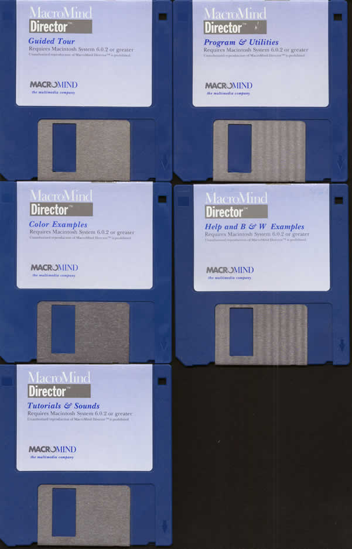

# macr

[images of Macromind/Macromedia/Adobe Director](./director-boxes/README.md)

[images of Books on Director](./books/README.md)

[Good Bye Director](https://blogs.adobe.com/creativecloud/the-future-of-adobe-contribute-director-and-shockwave/)
"As customers embrace the new features and efficiencies offered by Creative Cloud, we will no longer be selling and supporting Adobe Director and Contribute, which was last released in 2012.  Sale of Adobe Director and Contribute will stop on February 1, 2017.   We will also stop ongoing updates and support for Adobe Shockwave on Mac devices on March 14th after the last release of the product."

[Directory History](http://lingoworkshop.com/Articles/history)
